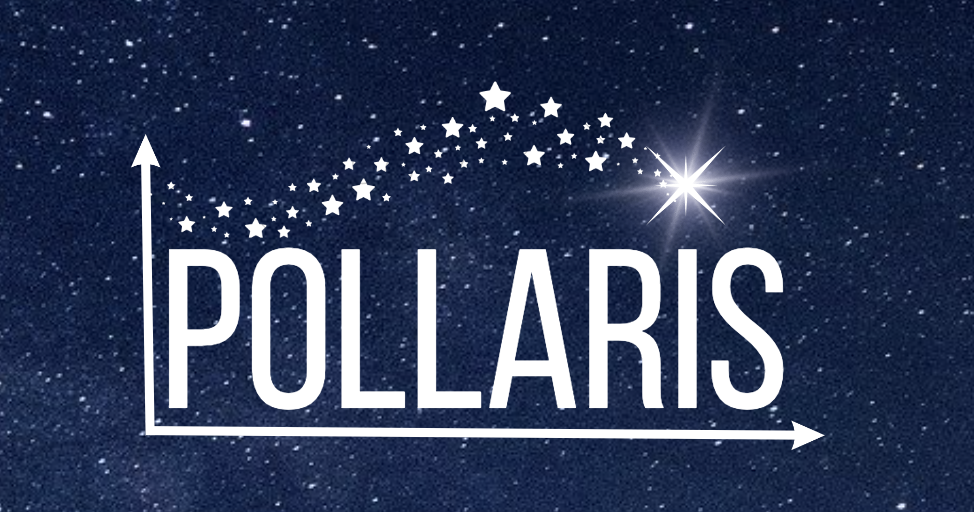

---

 # POLLARIS: Crafting Polls & Charting Trends

#### Pollaris is a web app where users can create their own polls, share them with others, and analyze the trends.
 
Team Members: Catalina Escalona, Ryan Sansbury, Gregory Webster
 
 
CSPB 3308 - Fall 2023 - University of Colorado Boulder

 ---

# Software Tools - Backend (1/2):

#### Flask (Python) for Project Web App Framework
* This was a great, simple, and dynamic framework for building our site.

#### Jinja (Python) for Template Engine
* This enabled us to create dynamic content rendering in Flask.

---

# Software Tools - Backend (2/2):

#### SQL for Database Queries
* This was an essential tool for handling our database information.

#### Render for Web Hosting of Site and Database
* This tool simplified our site hosting and deployment processes.

---

# Software Tools - Frontend (1/2):

#### Canva for Webpage Mockups
* This was highly valuable free tool that enabled the creation of visual page mockups and design concepts.

#### HTML for Webpage Structure
* This allowed us to build the foundational structure of our site and enabled quick and simple development.

---

# Software Tools - Frontend (2/2):

#### CSS for Webpage Styling
* This enabled site style elements to be implemented and provided an enhanced user interface.

#### JavaScript / jQuery for Webpage Dynamic Elements
* These tools were essential in adding dynamic elements and more advanced functionality to our project.

---

# Software Tools - Project Management (1/2):

#### Trello for Sprint Board
* This was an effective tool for tracking our project sprints. The card system was very useful for tracking meetings, project tasks, and overall project development.
  
#### Zoom for Weekly Meetings
* This was a great communication tool that enabled video conferencing and increased team cohesion while working in a remote environment.

#### iMessage for Team Communication
* This was a good tool for quick communication and updates, but made keeping a centralized record of tasks and decisions challenging. 

---

# Software Tools - Project Management (2/2):

#### GitHub for Project Repository and Version Control
* This was a very valuable tool that enabled collaborative development for our team. Merging branches presented some challenges that we worked through.

#### Markdown for Project Documentation
* This tool was useful in simplifying and maintaining comprehensive project documentation. 

---

# Software Tools - Code Editors:

#### Terminal
* This was a good tool for various development tasks, although basic with limited functionality.

#### Visual Studio Code
* This was a great code editing tool that enabled a a feature rich development environment.

---

# Challenges We Encountered (1/2):

* One of our teammates left mid semester, which impacted project continuity and required us to each individually take on his portions of the project.

* Figuring out how frontend and backend fit together presented a significant challenge. We overcame this with frequent testing, debugging, and trial and error.

---

# Challenges We Encountered (2/2):

* We were unsure of the best practices to implement solutions in new and unfamiliar languages. Each team member had different approaches to development, which worked out well, but having a senior developer to guide on best practices would have been extremely helpful. 
* The merging of everyone's local code changes in GitHub while keeping the site working was one of the most challenging aspects of the project. 

---

# Pollaris Demo Video